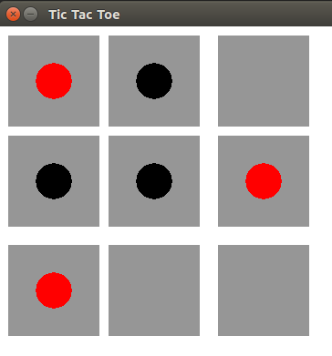

# Implementation of Tic Tac Toe game and engine using Reinforcement Learning (RL)

In this repository, the Tic Tac Toe game is implemented and an RL bot is trained using self play and a simple Temporal Difference method.

Tic Tac Toe is a zero sum game with perfect information available to RL agent.
There are 9 cells in the 3 x 3 grid and each cell can have 3 possible values (player_X, player_O, empty).

Total number of states = 3^9 = 19683 (including not reachable states)

Idea is to train a RL agent to learn/estimate a value for each state by self play using one step lookahead Temporal Difference (TD) method.

### Temporal Difference (TD) learning
On policy TD(0) update: State values are initialized to positive (+1) or negative (-1) values if the agent is winning or losing position. 
Rest of state values are estimated during training by one-step update. 

RL agent is trained using epsilon greedy policy with decreasing value of epsilon. 
Update Equation is given by,

v(s) &leftarrow; v(s) + &alpha; (v(s') - v(s))
 
where,

Value of the current state: v(s)

Value of the next state: v(s')

Step size or learning rate: &alpha;

### Pygame - User Interface
Python package pygame has been used to build a simple UI for Tic Tac Toe. 
When started, it loads the state values from the saved text file for RL agent and randomly picks the player to start the game. 
If RL agent is chosen, it starts the game and user has to click on the square to mark in his/her turn. 
 

Black dots are RL agents' whereas Red dots are by the user. Once a game is over, click anywhere on the game screen to start a new game.

#### Instructions to run:
* Run game_app.py to play the game in pygame interface with the trained RL agent
* Run training_self_play.py to train the RL agent using self play
* Run test_game.py to play the game in the terminal with the trained RL agent

Developed and tested on python version: 3.5.2. 
Check requirements.txt for additional packages. 

#### References
1. https://ipvs.informatik.uni-stuttgart.de/mlr/wp-content/uploads/2018/05/18-RL-td.pdf
2. https://nestedsoftware.com/2019/07/25/tic-tac-toe-with-tabular-q-learning-1kdn.139811.html
3. https://towardsdatascience.com/lets-beat-games-using-a-bunch-of-code-part-1-tic-tac-toe-1543e981fec1
4. https://medium.com/violante.andre/simple-reinforcement-learning-temporal-difference-learning-e883ea0d65b0
