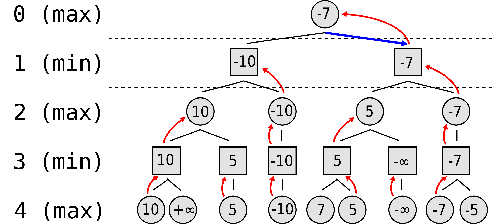
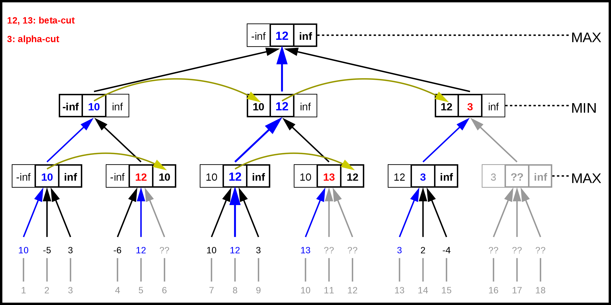

# Tic Tac Toe

This is a terminal based implementation of the game tic tac toe.
Additionally, there are two algorithms which are unbeatable.

Tic Tac Toe is a 2 player game with perfect information.

## Minimax

 

 Minimax algorithm calculates every possible state and this way finds the optimal game. It assumes an optimal opponent which tries to reduce the result.
 If the computer has to make the first move, it has to calculate 9! moves in total. So even for a simple and small game like tic tac toe it takes some time on a new laptop.

## Alpha Beta

 

 The alpha beta is a sligtly improved version of the minimax algorithm. It still garantues an optimal game but it is a lot faster.
